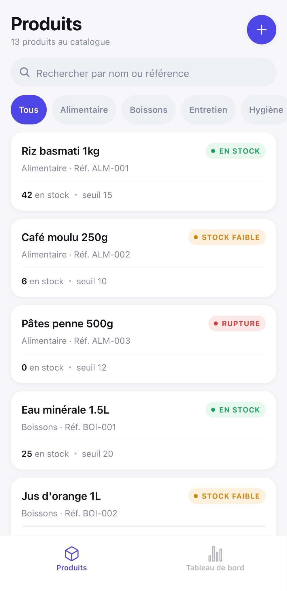
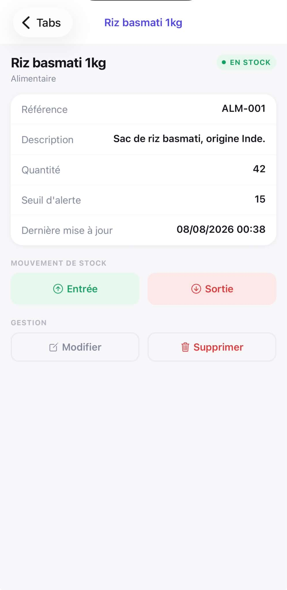
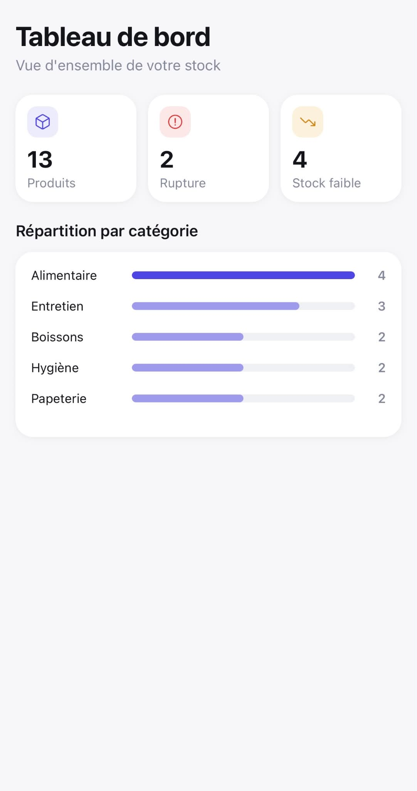
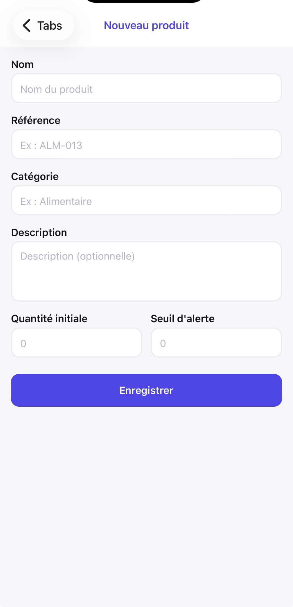
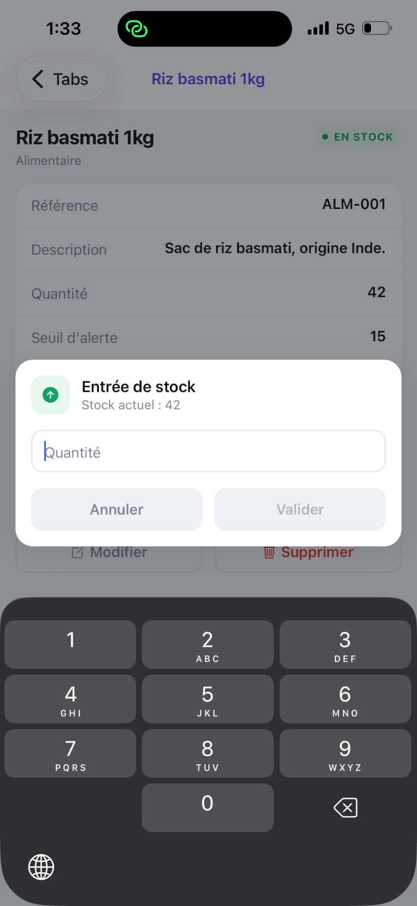

# Stock Manager

Application mobile de gestion de stock développée avec Expo et React Native (TypeScript). Elle permet de suivre un catalogue de produits, leurs mouvements de stock (entrées/sorties), et propose un tableau de bord avec quelques statistiques et un graphique de répartition par catégorie.

Projet réalisé dans le cadre d'un exercice technique.

## Prérequis

Versions utilisées pour le développement :

- Node.js 22.14.0
- npm 10.9.2
- Expo SDK 54
- React Native 0.81.5
- TypeScript 5.9.2

Pour tester l'application sur un appareil physique, l'application **Expo Go** doit être installée (disponible sur l'App Store et le Play Store). Un émulateur Android ou un simulateur iOS fonctionnent également.

## Installation

```bash
npm install
```

## Lancement

```bash
npx expo start
```

Le terminal affiche un QR code. Pour l'ouvrir :

- **Sur un téléphone** : scanner le QR code avec l'appareil photo (iOS) ou directement depuis l'app Expo Go (Android).
- **Sur un émulateur Android** : appuyer sur `a` dans le terminal (Android Studio doit être installé et un émulateur lancé).
- **Sur un simulateur iOS** : appuyer sur `i` dans le terminal (macOS + Xcode requis).

Aucune configuration supplémentaire n'est nécessaire : toutes les données sont stockées localement sur l'appareil.

## Captures d'écran

<!-- Remplacer par de vraies captures une fois l'application testée -->

| Liste des produits | Détail produit | Tableau de bord |
| --- | --- | --- |
|  |  |  |

| Formulaire produit | Mouvement de stock |
| --- | --- |
|  |  |

## Choix techniques

**Expo** a été choisi plutôt qu'un projet React Native "bare" pour la rapidité de mise en place et parce que l'exercice n'a pas besoin de code natif custom. Cela évite de configurer Xcode/Android Studio juste pour lancer le projet, et le testeur peut ouvrir l'app en quelques secondes via Expo Go. La contrepartie est un contrôle un peu plus limité sur certaines configurations natives, ce qui n'est pas un problème ici.

**Zustand** a été préféré à Redux pour la gestion d'état. Pour une application de cette taille, Redux (actions, reducers, store, éventuellement des slices RTK) aurait ajouté beaucoup de code répétitif pour un gain limité. Zustand permet d'écrire le store en quelques dizaines de lignes, avec un typage TypeScript direct et sans boilerplate, tout en restant largement suffisant si l'application devait grossir.

**La persistance est locale** (AsyncStorage, via le middleware `persist` de Zustand) plutôt que via un backend. Cela correspond au périmètre de l'exercice, qui porte sur l'application mobile et laisse volontairement la partie serveur de côté. Cette approche a aussi l'avantage d'être "offline-first" par défaut et de ne demander aucune installation côté testeur (pas de serveur à lancer, pas de base de données à configurer). L'inconvénient est évidemment l'absence de synchronisation entre appareils.

**Une couche de service** (`src/services/productService.ts`) isole la logique métier (création d'un produit, application d'un mouvement de stock, vérification d'unicité de référence) de la mécanique du store Zustand. Le store appelle ces fonctions plutôt que de manipuler les tableaux de produits directement. Si l'application devait un jour consommer une vraie API, seule cette couche serait à réécrire (probablement en fonctions asynchrones qui appellent `fetch`), sans toucher aux écrans.

**Le graphique de répartition par catégorie** est construit avec de simples composants `View` dont la largeur est calculée en pourcentage, plutôt qu'avec une librairie de charts. Pour un unique graphique en barres, ajouter une dépendance comme `victory-native` ou `react-native-svg` semblait disproportionné par rapport au résultat (quelques barres horizontales). Cette approche reste limitée si des graphiques plus complexes (courbes, camemberts) étaient nécessaires par la suite.

## Limitations connues

- **Notifications locales** : la vérification de rupture de stock au lancement utilise `expo-notifications`. Dans Expo Go sur Android, le support des notifications push a été retiré depuis le SDK 53 ; les notifications locales fonctionnent en général, mais peuvent échouer selon la version d'Expo Go installée. L'appel est protégé par un `try/catch` et une vérification des permissions : en cas d'échec, l'application continue de fonctionner normalement sans notification.
- **Pas d'authentification** : l'application ne gère qu'un seul utilisateur, sans notion de compte ni de connexion.
- **Pas de synchronisation multi-appareils** : les données étant stockées localement (AsyncStorage), elles ne sont pas partagées entre plusieurs téléphones ou avec un serveur.
- La catégorie d'un produit est un champ texte libre plutôt qu'une liste fermée ; il n'y a donc pas de protection contre les doublons liés à la casse ou aux espaces (ex. "Boissons" vs "boissons ").

## Structure du projet

```
src/
  components/        composants UI réutilisables
    CategoryBarChart.tsx
    CategoryChips.tsx
    FormField.tsx
    ProductCard.tsx
    StatCard.tsx
    StatusBadge.tsx
    StockMovementModal.tsx
  screens/            écrans de l'application
    DashboardScreen.tsx
    ProductDetailScreen.tsx
    ProductFormScreen.tsx
    ProductListScreen.tsx
  navigation/         configuration de la navigation
    RootNavigator.tsx
    TabNavigator.tsx
    types.ts
  services/           logique métier, indépendante du store
    notificationService.ts
    productService.ts
  store/              store Zustand + données de démo
    productStore.ts
    seedProducts.ts
  theme/              couleurs, espacements, typographie
    theme.ts
  types/              types TypeScript partagés
    product.ts
  utils/              fonctions utilitaires (dates, id, debounce)
    formatDate.ts
    id.ts
    useDebouncedValue.ts
App.tsx
```
